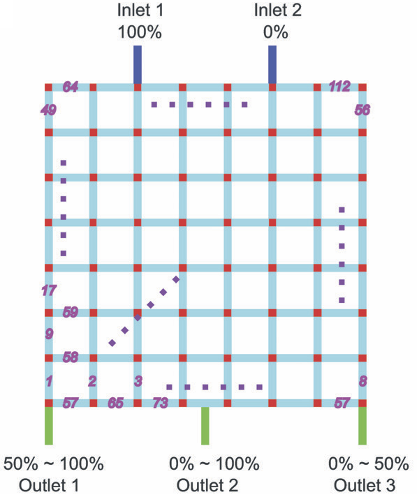

# Random Design of Microfluidics

This site provides supplementary material to accompany the paper ["Random Design of Microfluidics" by Junchao Wang, Philip Brisk, and William H. Grover, *Lab on a Chip* **16**, 4212-4219 (2016)](https://pubs.rsc.org/en/content/articlelanding/2016/lc/c6lc00758a) [(PDF)](https://groverlab.org/assets/random-microfluidics.pdf).

The file [random.csv](random.csv) contains a table summarizing the results from all 10513 random microfluidic chip designs that were generated and simulated in the above paper.  This is a text file in [CSV (comma-separated values) format](https://en.wikipedia.org/wiki/Comma-separated_values).  Each line or row in the file corresponds to one random microfluidic chip design, and commas are used to separate the columns in the file.

The first 112 columns on each row each contains a `1` if a particular channel is present in that row's chip design or a `0` if that channel is absent in the design.  The order of the columns corresponds to the purple numbers on the channels in this figure from the above paper:

So for example, column 1 contains a `1` if channel 1 is present in that row's design and `0` if channel 1 is absent, colum 2 contains a `1` if channel 2 is present in that row's design and `0` if channel 2 is absent, and so on, all the way to column 112 (channel 112).

The remaining six columns on each row summarize the simulation results for that row's design.

Columns 113, 114, and 115 are the predicted flow rates at Outlet 1, Outlet 2, and Outlet 3, respectively.  The units are meters per second.

Columns 116, 117, and 118 are the predicted solute concentrations at Outlet 1, Outlet 2, and Outlet 3, respectively.  The units are arbitrary and range from 0 (a 0% concentration of solute, which is also the same as the concentration of the fluid flowing into Inlet 2) to 1 (a 100% concentration of solute, which is also the same as the concentration of the fluidic flowing into Inlet 1).

